# Developer Guide

---

## Acknowledgements

{list here sources of all reused/adapted ideas, code, documentation, and third-party libraries -- include links to the original source as well}

---

## Architecture

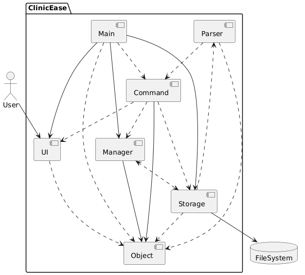

The **Architecture Diagram** given above explains the high-level design of the ClinicEase application. The diagram shows the components of the system organized by packages and how they interact with each other.

Given below is a quick overview of each component and how they interact with each other:

### Main components of the architecture

The application consists of the following components:

* **Miscellaneous**: Contains the user interface and parser components.
  * **UI**: Handles user interaction, displays information to the user, and reads commands from the console.
  * **Parser**: Processes user input strings and converts them into appropriate Command objects.

* **Main**: The entry point of the application and acts as the orchestrator that connects all other components

* **Command**: Follows the Command pattern to implement various operations.
  * **Command (Main)**: An abstract class that all specific commands extend.
  * **Various Commands**: Specific command classes (AddPatientCommand, DeletePatientCommand, etc.) that implement different operations.

* **Manager**: The central coordinator that manages collections of entities and implements business logic.

* **Object**: Patient, Appointment, and Prescription classes that represent domain objects.

* **Storage**: Saves and loads data to/from files on disk.

### How the architecture components interact with each other

The **Sequence Diagram** below shows how the components interact for the scenario where the user executes a `delete-patient` command:

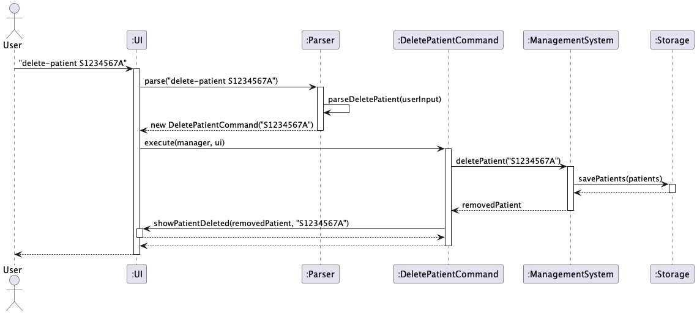

The typical flow of execution in the system is as follows:

1. User enters a command through the UI
2. UI passes the command string to the Parser
3. Parser analyzes the command and creates the appropriate Command object
4. Command object executes the operation, interacting with the ManagementSystem
5. ManagementSystem updates its internal state and may request the Storage to save changes
6. Results are displayed to the user through the UI

This architecture follows several design principles:

1. **Single Responsibility Principle**: Each component has a specific responsibility
2. **Separation of Concerns**: UI logic is separated from business logic which is separated from data persistence logic
3. **Command Pattern**: Commands encapsulate actions and provide a uniform interface for execution
4. **Entity-Control Separation**: Entity classes (Patient, Appointment, Prescription) are separate from the controlling ManagementSystem that operates on them

---

## Design 

<br>

---
## Command Component
**API** : [Command Classes](https://github.com/AY2425S2-CS2113-T11b-4/tp/tree/master/src/main/java/command)  

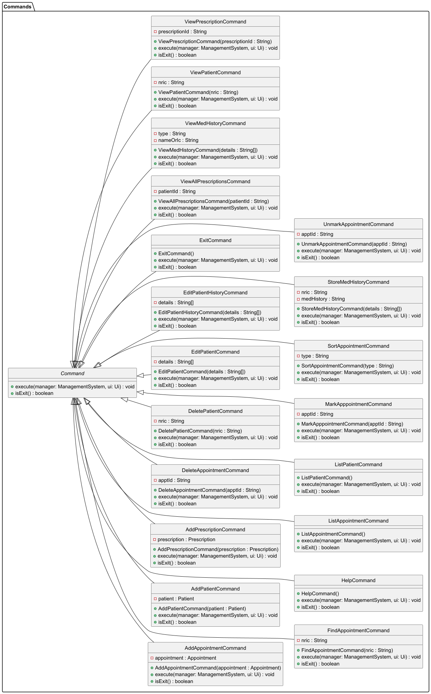  

---

### Overview

The `Command` component is responsible for **handling and executing user commands** in ClinicEase. It defines a common interface (`Command`) for all commands and organizes the various command classes (e.g., `AddAppointmentCommand`, `DeletePatientCommand`) that operate on the `ManagementSystem` and interact with the `Ui` to provide application functionality.

---
### Responsibilities

1. **Encapsulate Command Logic**: Each command class holds the data or parameters needed to carry out a specific user request (e.g., adding a new appointment, deleting a patient).
2. **Execute on System**: Using a uniform `execute()` interface, commands interact with the `ManagementSystem` to perform the requested action.
3. **Provide Exit Control**: Certain commands can signal the application to terminate (e.g., `ExitCommand`), by overriding `isExit()` to return `true`.

---

### Key Features

- **Abstract Base Class**  
  `Command` is declared as an abstract class, defining two key methods:
    - `execute(manager: ManagementSystem, ui: Ui) : void` – where the command’s logic is implemented.
    - `isExit() : boolean` – indicates if the command should terminate the main program loop.

- **Multiple Subclasses**  
  Each subclass, such as `AddPatientCommand` or `FindAppointmentCommand`, implements the `execute()` method to fulfill a specific function (adding a patient, finding an appointment, etc.).

- **Command Pattern**  
  This design follows a simplified [Command Pattern](https://en.wikipedia.org/wiki/Command_pattern), enabling a clear separation of concerns between **input parsing**, **system logic**, and **UI presentation**.

---

### Structure

1. **Single Abstract Class**  
   `Command` resides at the top of the hierarchy.

2. **Subclasses**
    - **AddAppointmentCommand** — adds a new appointment to the system.
    - **DeletePatientCommand** — removes a patient by NRIC.
    - **SortAppointmentCommand** — sorts appointments by date or ID.
    - *(... other commands like `EditPatientCommand`, `ViewPrescriptionCommand`, etc.)*

3. **Uniform Execution**  
   All command classes share the same `execute()` signature but implement distinct behaviors.

---

### Dependencies

- **`ManagementSystem`**: Each command calls methods from `ManagementSystem` to manipulate the core data (patients, appointments, prescriptions).
- **`Ui`**: Commands display success/failure messages and prompt user outputs via the `Ui` component.
- **`Parser`**: Typically, commands themselves do not parse raw input strings. Instead, the `Parser` constructs a command object with the necessary parameters before execution.
- **`Storage`**: Some commands (e.g., `AddPatientCommand`) indirectly trigger save operations, relying on `ManagementSystem` which delegates to `Storage` to persist changes.

---

### Design Considerations

- **Extensibility**  
  Adding a new user action only requires creating a new `Command` subclass and updating `Parser` to recognize the new keyword(s).

- **Error Handling**  
  Commands may throw or handle exceptions such as `PatientNotFoundException` or `UnloadedStorageException`, ensuring robust operation even if data is invalid or storage is unavailable.

- **Single Responsibility**  
  Each command focuses on exactly one task (e.g., marking an appointment). This keeps classes small, cohesive, and easier to test or maintain.

---

### Remarks

- Commands are **stateless** aside from storing the **parameters** needed for execution (e.g., an appointment ID to be deleted).
- The **flow** is typically:
    1. `Parser` reads user input and creates an appropriate `Command` instance.
    2. The main loop calls `command.execute(manager, ui)`.
    3. If `command.isExit()` is `true`, the application terminates.

- This approach **decouples** user input parsing from application logic, making the system easier to extend without modifying existing commands.

> **Note:** The `Command` classes rely on the `Parser` to supply valid parameters. If parsing fails, `Parser` throws appropriate exceptions before the `Command` is even constructed.
---

### UI Component
**API**: [`Ui.java`](https://github.com/AY2425S2-CS2113-T11b-4/tp/blob/master/src/main/java/miscellaneous/Ui.java)

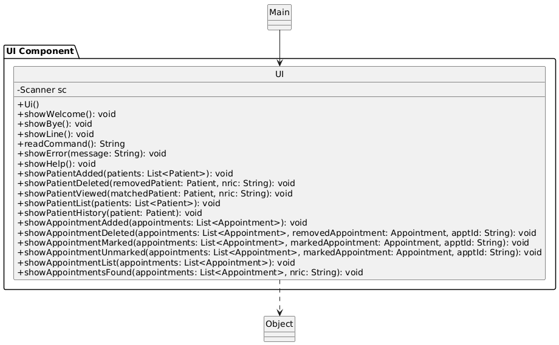

The `UI` component is responsible for handling all user interactions. It presents messages to the user, reads user inputs, and displays command results or errors.

#### Responsibilities

- Display a welcome message, help instructions, and goodbye message.
- Accept and return user input from the command line.
- Display confirmation messages and outputs for commands such as `add-patient`, `delete-patient`, `view-patient`, `add-appointment`, etc.
- Print errors and validation issues clearly to the user.

#### Key Features

- Uses `Scanner` to read input from `System.in`.
- Methods like `showPatientAdded()`, `showAppointmentMarked()`, and `showPatientList()` format data in a readable and consistent way.
- Provides contextual error messages via `showError()` to aid debugging and usage.

#### Dependencies

**Model**: Uses `Patient` and `Appointment` for displaying information.

<br>

### Main component
**API**: [`ClinicEase.java`](https://github.com/AY2425S2-CS2113-T11b-4/tp/blob/master/src/main/java/ClinicEase.java)

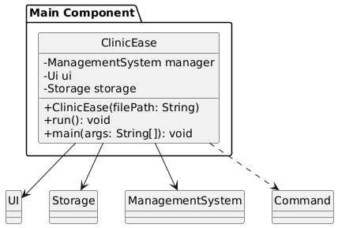
The `Main` component is the **entry point** of the application.

#### Responsibilities

- Initializes core components: `Ui`, `Storage`, and `ManagementSystem`.
- Loads previously saved patient, appointment, and prescription data using `Storage`.
- Runs the main input loop by:
    - Reading commands via `Ui`
    - Parsing them into `Command` objects via `Parser`
    - Executing commands with access to `ManagementSystem` and `Ui`
- Handles exceptions gracefully and displays errors to the user when needed.

> While not a logic-heavy component itself, `Main` serves as the **coordinator** that ties together UI, command parsing, logic execution, and data storage.

<br>


### Parser Component
**API** : [`Parser.java`](https://github.com/AY2425S2-CS2113-T11b-4/tp/blob/master/src/main/java/miscellaneous/Parser.java)

#### Overview of the `Parser` Component
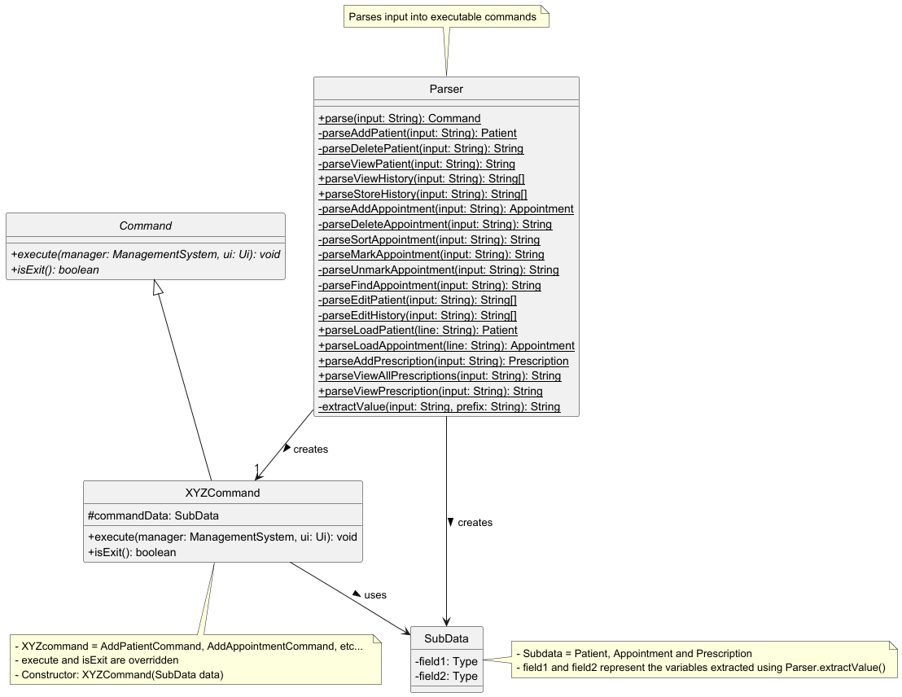

- **Parser:**
  - **Public API:** `parse(input)` 

  - **Helper Methods:** `parseAddPatient()`, `parseAddAppointment()`, etc.
    - These methods extract and validate input (using extractValue()), then return domain objects (Patient, Appointment, etc.).

  - **Utility Method:** `extractValue()` (reusable parameter extractor).

- **Command:** 
  - **Abstract Superclass:** Defines `execute()` and `isExit()` for all commands.
  - **Subclasses:** `AddPatientCommand`, `DeleteAppointmentCommand`, etc.
  - Each accepts specific data (e.g., `AddAppointmentCommand` takes an `Appointment`).

The sequence diagram below illustrates the interactions within the `Parser` component, taking parse(`add-appointment ic/S1234567D dt/2025-04-05 t/1400 dsc/Consultation`)
as example:
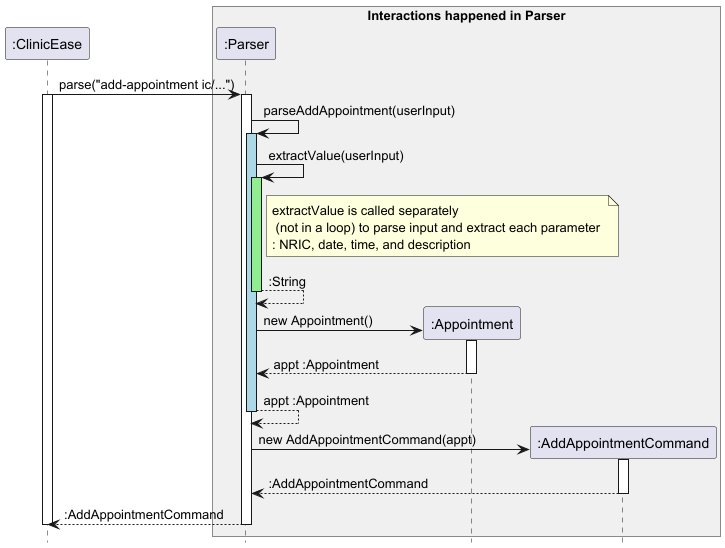

> This sequence diagram only focus on the interactions within the `Parser` component, the other components 
> such as `Ui`, `ManagementSystem` and `Storage` are omitted.

How the `Parser` component works:
1. When `Parser` is called upon to parse a user command, `Parser` splits the input to identify the command type (e.g. `add-appointment`).
   A `switch-case` delegates to the appropriate helper method:
````
public static Command parse(String userInput) throws InvalidInputFormatException, UnknownCommandException {
    //...  
    String[] parts = userInput.split(" ", 2);
    String commandWord = parts[0].toLowerCase();
    switch (commandWord) {
    //...
    case "add-appointment":
        return new AddAppointmentCommand(parseAddAppointment(userInput));
    //...
````

2. The helper method (e.g., `parseAddAppointment()`) uses `extractValue()` to:
    - Extract parameters (`ic/`, `dt/`, `t/`, `dsc/`) from the raw user input
    - Validate formats (e.g., NRIC format, date parsing)

3. The `Appointment` object will be constructed using extracted data. Then, `AddAppointmentCommand` 
    object is created, it will be returned to `ClinicEase` for further operations.
---

<br>


### Manager Component

**API**: [`ManagementSystem.java`](https://github.com/AY2425S2-CS2113-T11b-4/tp/blob/master/src/main/java/manager/ManagementSystem.java)


The `ManagementSystem` class in manager component acts as the central coordinator, responsible for managing features for **Patient**, **Appointment**, and **Prescription** entities. It provides methods to add, remove, and retrieve these objects, ensuring business logic is applied and maintaining the integrity of the system’s data.

#### Responsibilities

- Manages instances of **Patient**, **Appointment**, and **Prescription** objects.
- Provides centralized methods for adding, removing, and retrieving from **Patients**, **Appointments**, and **Prescriptions**.
- Links **Appointments** and **Prescriptions** to their respective **Patients**.
- Ensures consistency of data, validating changes before committing them to the system.
- Handles business logic related to managing patients, their appointments, and prescriptions.

#### Key Features

- Provides **methods** for managing **Patients**, **Appointments**, and **Prescriptions**.
- Ensures relationships between **Patients**, **Appointments**, and **Prescriptions** are properly maintained.
- Handles validation logic to ensure that the data is accurate and consistent (e.g., cannot add duplicate appointments or prescriptions).
- Can interact with **Storage** to persist changes made to patients, appointments, and prescriptions.

#### Structure

- The core functionality is provided through a **single class** (ManagementSystem), where all methods for interacting with the system’s data are defined.
- Utilizes **arraylists** to store and manage **Patient**, **Appointment**, and **Prescription** objects.
- The **ManagementSystem** class contains methods like `addPatient()`, `removePatient()`, `getPatient()`, etc., and primarily serve to manage the logic behind those operations.

<br>

### Objects Component


The **Objects** component defines the objects used by the **Manager** component, which are **Patient**, **Appointment**, and **Prescription**. These objects encompass the data and behavior specific to their respective classes.

---

#### Patient Class

**API**: [`Patient.java`](https://github.com/AY2425S2-CS2113-T11b-4/tp/blob/master/src/main/java/manager/Patient.java)

The `Patient` class represents a patient, including personal details, appointments, and prescriptions.

##### Responsibilities

- Encapsulates the **patient’s personal data** (e.g., name, contact information).
- Manages associated **appointments** and **prescriptions** for the patient.

##### Key Features

- Stores **personal details** like name, gender, and contact information.
- Can hold **appointments** and **prescriptions** for the patient.
- Provides methods for managing appointments and prescriptions directly tied to the patient.

---

#### Appointment Class

**API**: [`Appointment.java`](https://github.com/AY2425S2-CS2113-T11b-4/tp/blob/master/src/main/java/manager/Appointment.java)

The `Appointment` class represents an appointment, typically linked to a patient and a date and time. It contains details such as the appointment time, description and status.

##### Responsibilities

- Represents an **appointment** between a **patient** and a **doctor**.
- Stores information about the **date**, **time**, and **status** of the appointment.
- Allows updating the **status** of the appointment as completed.

##### Key Features

- Holds **appointment-related data**, including date, time, and status.
- Links to a **Patient** and optionally to a **Doctor**.
- Provides functionality to mark it as done.

##### Dependencies

- **Model**: Dependent on the **Patient** class for representing relationships with appointments.
- **ManagementSystem**: The **ManagementSystem** interacts with this class to manage appointments for patients.

---

#### Prescription Class

**API**: [`Prescription.java`](https://github.com/AY2425S2-CS2113-T11b-4/tp/blob/master/src/main/java/manager/Prescription.java)

The `Prescription` class represents a prescription, typically linked to a patient and a doctor. It contains the prescribed medications and dosage instructions.

##### Responsibilities

- Represents a **prescription** issued by a **doctor** for a **patient**.
- Stores information about **medicines**, **dosage**, and **doctor notes**.
- Allows updates to the **dosage** or addition of new medications.

##### Key Features

- Holds **prescription-related data**, including medicine names, dosage, and additional instructions.
- Links to a **Patient** to ensure the prescription is tied to the correct patient.
- Provides methods to update the **dosage** or add new medicines.

##### Dependencies

- **Model**: Dependent on the **Patient** class to represent which patient the prescription is associated with.
- **ManagementSystem**: The **ManagementSystem** interacts with this class to manage prescriptions and ensure they are associated with the correct patient.

<br>


### Storage Component
**API** : [`Storage.java`](https://github.com/AY2425S2-CS2113-T11b-4/tp/blob/master/src/main/java/storage/Storage.java)

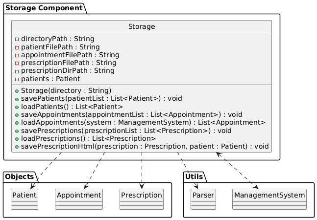
The `Storage` component is responsible for reading from and writing to the file system to ensure persistence of application data in `ClinicEase`.

#### Responsibilities

The `Storage` class handles:
- Saving and loading **Patients** from `patient_data.txt`
- Saving and loading **Appointments** from `appointment_data.txt`
- Saving and loading **Prescriptions** from `prescription_data.txt`
- Generating HTML files for prescriptions into a `/prescriptions/` directory

#### Key Features

- Each data type is stored in its own file.
- Upon loading, `Storage` uses the `Parser` class to reconstruct objects like `Patient` and `Appointment`.
- When appointments are loaded, they are automatically linked to the corresponding patients via the `ManagementSystem`.

#### Structure

- All methods are defined within a **single `Storage` class** with static methods like `savePatients()`, `loadAppointments()`, etc.  
- Initialization is done through the constructor `Storage(String directory)`, which sets the correct file paths.

#### Dependencies

- **Model**: Uses `Patient`, `Appointment`, and `Prescription` objects for reading/writing.
- **Commons**: Uses constants and utility methods if applicable.
- **Parser**: Converts text from the file back into model objects.
- **ManagementSystem**: Required to link appointments to patients during data loading.

> **Note:** `Storage` should be initialised before calling any static methods that rely on file paths. Otherwise, `UnloadedStorageException` will be thrown.

<br>

## Implementation

### View patient feature

The 'view-patient' feature allows the user to retrieve and view the personal details of a specified patient.

**Step 1.** The user launches the application for the first time.
- The `ClinicEase` will be initialized and load stored patient data.
- The patient's details are now ready to view.

**Step 2.** The user executes `view-patient ic/S1234567D` command to view the patient's details.
- This command lets `ClinicEase` read the user input through the `UI` and pass it to `Parser`.
- The `Parser` class determines that the command is `view-patient` and creates a `ViewPatientCommand` object.

> **Note:**
> If the input does not match the expected format, an `InvalidInputFormatException` is thrown. Hence, the patient's details will not be retrieved.

**Step 3.** The system calls `execute()` method in `ViewPatientCommand`.
- This class calls for the patient list in `ManagementSystem`.
- The system checks if the patient exists in the list:
    - If the NRIC exists, the system retrieves the patient's details.

**Step 4.** If the patient is found, the system calls `showPatientViewed()` from `UI`.
- The patient's details are displayed to the user.

The sequence diagram below illustrates how the operation for 'view-patient' would be executed in the system.

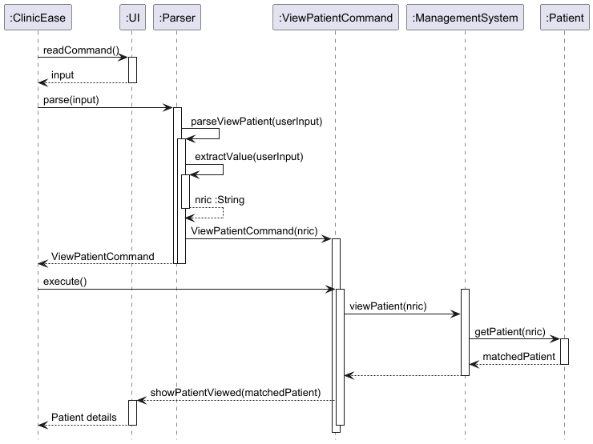

---

### Add/delete appointment feature
The `add-appointment` and `delete-appointment` features allow users to manage appointments for registered patients. 
The system ensures that the **patient exists** before adding the appointment and that the **appointment exists** before deleting it. 
All changes are stored persistently.

#### Add Appointment
The add-appointment feature lets users schedule appointments for patients who are already registered in the system.

**Example usage scenario** and how the `add appointment` mechanism behaves at each step:

Step 1. The user launches the application for the first time. The `ClinicEase` is initialized with the stored list of 
patients and appointments. The user is now ready to add a new appointment.

Step 2. The user executes the command: `add-appointment ic/S1234567D ...` to add the appointment to the appointment list. 
This command let `ClinicEase` class reads the user input and passes it to the `Parser`. 
The `Parser` class determines that the command is `add-appointment` and creates an `AddAppointmentCommand` object.

````
public static Command parse(String userInput) throws InvalidInputFormatException, UnknownCommandException {
    //...
    case "add-appointment":
        return new AddAppointmentCommand(parseAddAppointment(userInput));
    //...
````

> **Note:** <br>
> If the input does not match the expected format, an InvalidInputFormatException is thrown. Hence, the appointment will
> not be successfully added and stored. 

Step 3. The system calls `execute()` method in `AddAppointmentCommand`. Then, this class calls `ManagementSystem.addAppointment()` 
to add the appointment to the system. `ManagementSystem` checks if the patient exists using `findPatientByNRIC()`. 
- If the patient is found, the system creates an `Appointment` object and adds it to the appointment list.
- Conditions the appointment fail to be added and stored:
  - If the patient's NRIC does not exist (a `PatientNotFoundException` is thrown).
  - If the appointment clashes with another scheduled within 1 hour (an `AppointmentClashException` is thrown).

Step 4. After the appointment is successfully added, `Storage.saveAppointments()` is called to update the stored appointment list.
If saving fails, `ClinicEase` catches an `UnloadedStorageException` and informs the user.

The following sequence diagram shows how an `add-appointment` operation goes through the system:
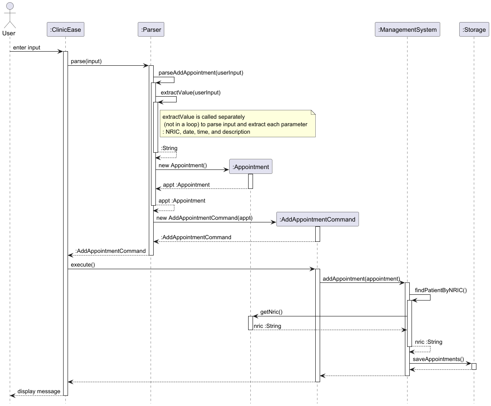
Note: Ui component is omitted (only represented by "Display message" here) for simplicity reason.

To clarify how is extractValue() called to extract each parameter:
````
public static Appointment parseAddAppointment(String input) throws InvalidInputFormatException {
    //...
    String nric = extractValue(temp, "ic/");
    String date = extractValue(temp, "dt/");
    String time = extractValue(temp, "t/");
    String desc = extractValue(temp, "dsc/");
    //...
````

#### Delete Appointment
The `delete-appointment` feature allows users to remove an appointment that is no longer required.

**Example usage scenario** and how the `delete appointment` mechanism behaves at each step:
Step 1. Suppose the user has already added one or more appointments and wishes to delete one. The appointment must 
exist in the current appointment list. 

Step 2. The user needs to know the appointment ID of the appointment to be deleted. If unsure, he/she may execute the 
`list-appointment` command to view all existing appointments.

Step 3. The user executes the command `delete-appointment A100`. Similar to `add appointment`, The `ClinicEase` class 
reads the user input and passes it to the `Parser`, which creates a `DeleteAppointmentCommand` object using the provided 
`APPOINTMENT_ID`.

````
public static Command parse(String userInput) throws InvalidInputFormatException, UnknownCommandException {
    //...
    case "delete-appointment":
            return new DeleteAppointmentCommand(parseDeleteAppointment(userInput));
    //...
````

Step 4. The system calls `execute()` method in `DeleteAppointmentCommand`. Then, it calls `ManagementSystem.deleteAppointment()`
which removes the corresponding `Appointment` object from the list.  

- The system searches for the appointment with the specified `APPOINTMENT_ID`.
- If found, it removes the appointment from the list.
- It also retrieves the corresponding patient using findPatientByNric() and updates the patient's internal appointment list.

> **Note:**
> - If the `APPOINTMENT_ID` is invalid, an error message will be displayed and the deletion will not proceed.
> - When a **specified patient** is **deleted**, all **appointment records associated** with that patient will be **removed** too. 

Step 5. After successful deletion, the system updates the stored list using `Storage.saveAppointments()`.

The following sequence diagram shows how an `delete-appointment` operation goes through the system **(positive case, 
where the appointment exists and is successfully deleted):** 


### Why they are implemented this way
The current design separates command parsing (`Parser`), command execution (`Command` subclasses), and core logic (`ManagementSystem`).
This structure helps improve modularity, testability, and clarity in our codebase.

- By using distinct `Command` classes (`AddAppointmentCommand`, `DeleteAppointmentCommand)`, each operation is encapsulated with its own logic, making it easier to maintain and extend.

- Centralizing the data logic in ManagementSystem so that it is easier to maintain and test appointment-related operations. 

- Validating `NRIC` and `APPOINTMENT_ID` before performing operations could prevent invalid data from entering the system and improves user experience by providing clear error feedback.

This design also aligns with the **Separation of Concerns** principle, allowing changes in one component (e.g., how appointments are stored) 
without affecting others (e.g., how commands are parsed or executed).

### Design considerations:
#### Aspect: Where to store appointment data

1. **Alternative 1 (current choice)**: Maintain a centralized appointment list in `ManagementSystem` and update each patient's internal appointment list.
   - **Pros:** Enables efficient listing, searching, and clash detection.
   - **Cons:** Requires synchronization between the central list and per-patient records (slight redundancy).
   

2. **Alternative 2:** Allowing appointment creation without verifying patient existence <br>
    - **Pros:** Simplifies implementation as patient verification is not needed.
    - **Cons:** Compromises data integrity, as appointments could become orphaned (unlinked to valid patients).
   

3. **Alternative 3:** Store appointments exclusively in `Patient` objects <br>
    - **Pros:** Keeps appointment data stored within each patient and reduces need for cross-references.
    - **Cons:** Aggregating all appointments becomes inefficient (require
      iterating through every patient); harder to search across patients and detect conflicts.

---

### Add patient feature
The `add-patient` feature allows users to register new patients by providing their personal information.  
The system ensures that the **input is valid** and that the **patient does not already exist** before adding them to the patient list.

**Step 1.**
The user launches the application for the first time. `ClinicEase` will be initialized with the saved data (if any).  
The system loads the stored list of patients and appointments. The user is now ready to register a new patient.

**Step 2.**
The user executes the following command to add a new patient:

`add-patient n/John Doe ic/S1234567A dob/1990-01-01 g/M p/98765432 a/123 Main St h/Diabetes, Hypertension`

This command is read by the `ClinicEase` class and passed to the `Parser`.  
The `Parser` class identifies the command as `add-patient` and parses the fields. A `Patient` object is then constructed from the parsed data.

> **Note**  
> If any required field (such as name, NRIC, or address) is missing, the parser will return `null`, and the system will display an appropriate error message.  
> The patient will not be added in this case.

**Step 3.**
The `ManagementSystem.addPatient()` method is called with the parsed input.  
The method first checks if a patient with the same NRIC already exists in the system.  
If the NRIC is unique and all details are present, a new `Patient` object is added to the patient list.

> **Note**  
> If the NRIC already exists, a message is shown to inform the user that the patient has already been registered.

**Step 4.**
After successful registration, `Storage.savePatients()` is called to update the saved patient list on disk.  
If saving fails, `ClinicEase` catches an `UnloadedStorageException` and alerts the user.

The following sequence diagram shows how an `add-patient` operation flows through the system:
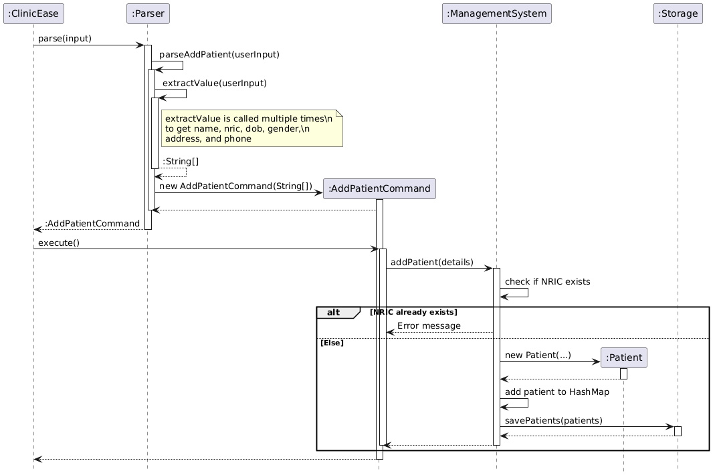

---

### Delete patient feature
The `delete-patient` feature allows users to **remove a patient** from the system using their **NRIC**.  
When a patient is deleted, all their associated **appointments** are also removed to maintain data consistency.

### Step 1.
The user launches the application. `ClinicEase` loads any saved data, including the patient list and appointments.  
The user is now ready to delete a patient from the system.

### Step 2.
The user executes the following command:

`delete-patient S1234567A`

This command is passed to the `Parser` class.  
The `Parser` identifies the command as `delete-patient`, extracts the NRIC `S1234567A`, and passes it to a new `DeletePatientCommand`.

> **Note**  
> If the input format is incorrect (e.g., `delete-patient` with no NRIC), the parser throws an `InvalidInputFormatException` and displays an error message to the user.

### Step 3.
The `DeletePatientCommand.execute()` method calls `ManagementSystem.deletePatient(nric)`.

The method first **searches for the patient** with the provided NRIC in the patient list.  
If found:
- The patient is removed from the list.
- All of the patient’s appointments are also removed.
- Both `patients` and `appointments` are saved using `Storage.savePatients()` and `Storage.saveAppointments()`.

> **Note**  
> If the NRIC is not found, the method returns `null` and an appropriate message is displayed.

### Step 4.
Once the patient is successfully deleted, a confirmation message is shown to the user.  
If saving to disk fails, an `UnloadedStorageException` is thrown and handled by the system to alert the user.

The following sequence diagram shows how a `delete-patient` operation flows through the system:
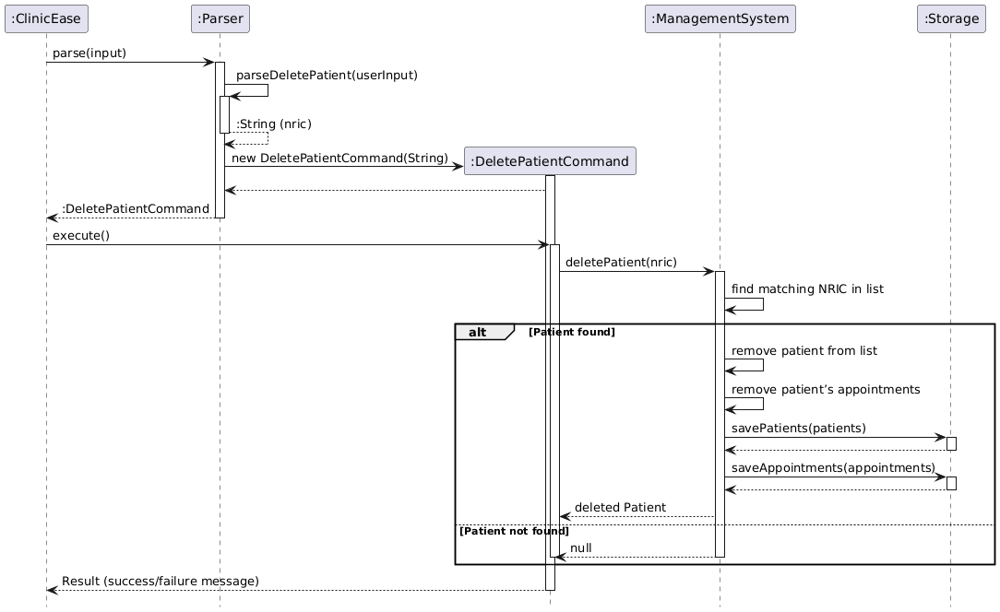

---

### Storing Medical History Feature

The `store-history` feature allows users to **add new medical history entries** for a specific patient in the system.  
The system verifies that the **patient exists** before adding the entries, then the updated data is saved persistently.

Below is a usage scenario illustrating how the `store-history` mechanism behaves step by step.

**Step 1.** The user executes a command such as:

store-history n/John Doe ic/S1234567A h/Diabetes,High Cholesterol
- **ClinicEase** reads this command and passes the input string to **Parser**.
- **Parser** identifies the command as `store-history` (based on the command word) and extracts the relevant parameters (`name`, `nric`, `h/` tokens).
- If the input is invalid (missing or malformed parameters), an `InvalidInputFormatException` is thrown, aborting the process.

**Step 2.** **Parser** creates a `StoreMedHistoryCommand` object with the extracted details:

- `StoreMedHistoryCommand` holds the `name` ("John Doe"), `nric` ("S1234567A"), and `medHistory` string ("Diabetes,High Cholesterol").

**Step 3.** `ClinicEase` invokes `StoreMedHistoryCommand#execute(...)`, which calls:

1. `ManagementSystem.storeMedicalHistory(name, nric, medHistory)`
2. `ManagementSystem` checks if the patient exists using `findPatientByNric(nric)`.
    - If **not found**, it prints an error, and **no** changes are made to storage.
    - If **found**, it splits `"Diabetes,High Cholesterol"` into an array of entries:
        - `"Diabetes"`
        - `"High Cholesterol"`
    - Then, it appends these entries to the patient's existing `medicalHistory` list (skipping duplicates).

**Step 4.** `ManagementSystem` calls `Storage.savePatients(...)` to persist any changes to the patient data on disk:

- If saving fails, `UnloadedStorageException` is thrown, and `ClinicEase` displays an error to the user.

Below is a detailed **PlantUML** sequence diagram showing how a `store-history` operation moves through the system and includes the check for a valid patient:
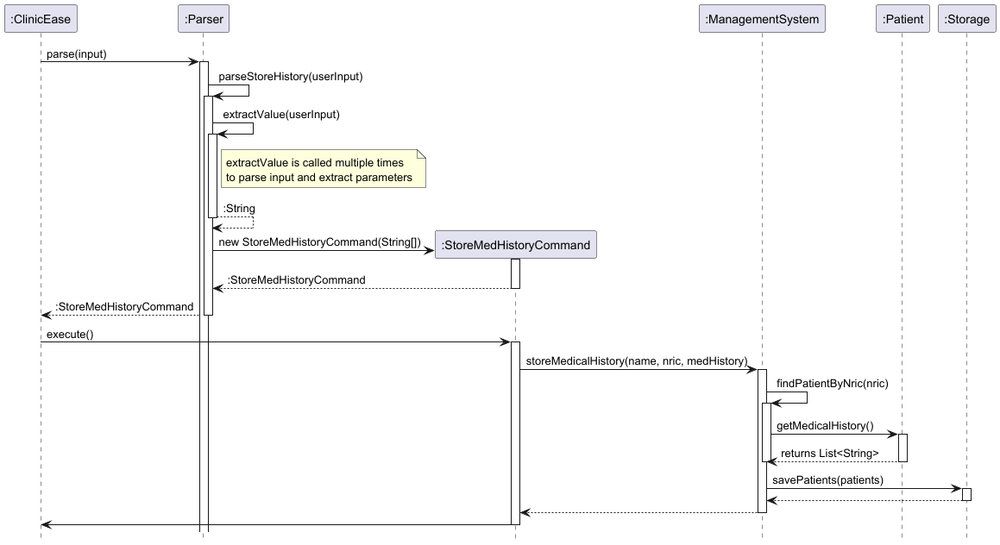

---

### Prescription Management Feature

The `add-prescription`, `view-prescription`, and `view-all-prescriptions` features allow doctors and medical staff to create and track medication prescriptions for patients within the clinic system. The system ensures that the **patient exists** before adding a prescription and handles the generation of unique prescription IDs and HTML documents for printing.

#### Adding a Prescription

The add-prescription feature allows users to create detailed prescriptions with symptoms, medicines, and optional notes for registered patients.

**Example usage scenario** and how the `add-prescription` mechanism behaves at each step:

Step 1. The user launches the application. The `ClinicEase` is initialized with stored patient, appointment, and prescription data. The user is now ready to add a new prescription.

Step 2. The user executes the command: 
```
add-prescription ic/S1234567A s/Fever,Cough m/Paracetamol,Cough syrup nt/Take after meals
```

This command lets `ClinicEase` read the user input and pass it to the `Parser`. The `Parser` determines that the command is `add-prescription` and creates an `AddPrescriptionCommand` object with a new `Prescription` object.

```java
public static Command parse(String userInput) throws InvalidInputFormatException, UnknownCommandException {
    //...
    case "add-prescription":
        return new AddPrescriptionCommand(parseAddPrescription(userInput));
    //...
}
```

> [!NOTE]:
> If the input does not match the expected format, an `InvalidInputFormatException` is thrown. Hence, the prescription will not be successfully added and stored.

Step 3. The system calls `execute()` method in `AddPrescriptionCommand`. This class calls `ManagementSystem.addPrescription(prescription)` to add the prescription to the system. 

The `ManagementSystem` verifies the patient exists using `findPatientByNric()`:
- If the patient is found, the system generates a proper prescription ID and creates a new `Prescription` object.
- If the patient's NRIC does not exist, an `IllegalArgumentException` is thrown.

Step 4. After the prescription is successfully added, `Storage.savePrescriptions()` is called to update the stored prescriptions list. If saving fails, an `UnloadedStorageException` is thrown and ClinicEase informs the user.

The following sequence diagram shows how an `add-prescription` operation flows through the system:
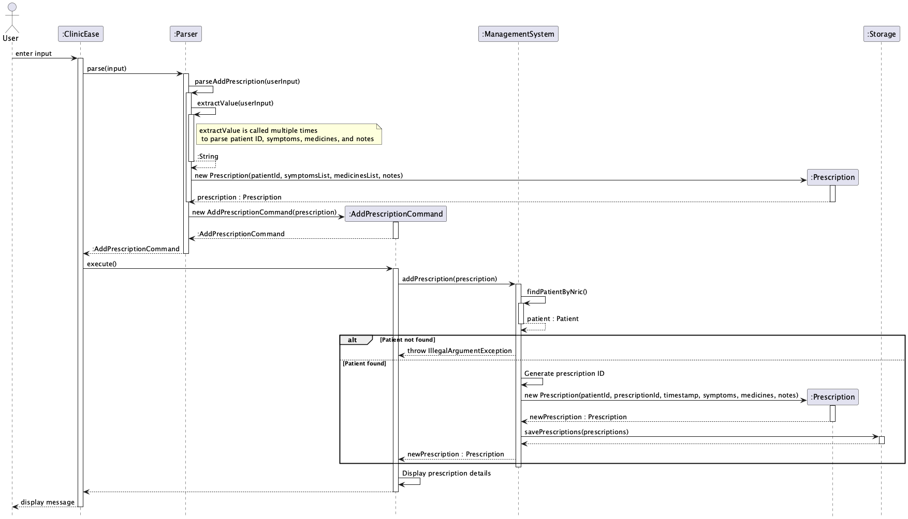

#### Viewing Prescriptions

The system provides two commands for viewing prescriptions:

1. **`view-all-prescriptions PATIENT_ID`** - Shows all prescriptions for a specific patient.
2. **`view-prescription PRESCRIPTION_ID`** - Shows details of a specific prescription and generates an HTML version.

**Example usage scenario** for `view-prescription`:

Step 1. The user needs to view a specific prescription and generate its printable HTML version. If the user knows the prescription ID, they can directly proceed to step 2. Otherwise, they may need to first use `view-all-prescriptions` to find the required ID.

Step 2. The user executes the command `view-prescription S1234567A-1`. The `Parser` extracts the prescription ID and creates a `ViewPrescriptionCommand` object.

Step 3. The system calls `execute()` in `ViewPrescriptionCommand`. The system fetches:
   - The prescription using `ManagementSystem.getPrescriptionById()`
   - The patient information using `ManagementSystem.viewPatient()`

Step 4. If the prescription is found, the system:
   - Displays the prescription details to the user
   - Generates an HTML file with `Storage.savePrescriptionHtml()`
   - Shows the file location to the user

> **Note:**
> If the prescription ID is invalid, an error message will be displayed and no HTML will be generated.

#### HTML Prescription Generation

An important feature of the prescription management system is the generation of printable HTML documents. This functionality is embedded within the `Prescription` class:

```java
public String generateHtml(Patient patient) {
    StringBuilder html = new StringBuilder();
    // Generate structured HTML with prescription details
    // Include patient information when available
    // Add print button and styling
    return html.toString();
}
```

The generated HTML provides:
- A professional format for printing
- All prescription details (ID, timestamp, symptoms, medicines)
- Patient information when available
- A print button for easy printing from any browser

#### Why It's Implemented This Way

The current design separates command parsing (`Parser`), command execution (command classes like `AddPrescriptionCommand`), and core logic (`ManagementSystem` and `Prescription`). This structure allows:

- Better modularity by separating different aspects of functionality
- Improved testability with clear interfaces between components
- Consistent approach with other features in the system
- Easy extension for future prescription-related features

The HTML generation approach was chosen as it provides a printable output without requiring additional libraries, while maintaining visual quality needed for medical documentation.

#### Class Structure

The implementation follows these key classes:

1. **Prescription** - Core class representing a prescription with all its attributes and conversion methods.
2. **Command Classes:**
   - **AddPrescriptionCommand** - Creates new prescriptions
   - **ViewPrescriptionCommand** - Displays a prescription and generates HTML
   - **ViewAllPrescriptionsCommand** - Lists all prescriptions for a patient
3. **ManagementSystem** - Maintains the list of prescriptions and provides methods to add and retrieve them
4. **Storage** - Handles saving and loading prescriptions from disk

The class diagram below shows the relationships between these classes:
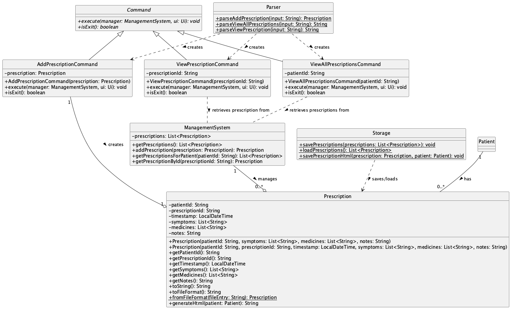

#### Design Considerations

##### Aspect: Prescription Identification

* **Alternative 1 (current choice):** Patient ID plus sequence number (e.g., "S1234567A-1").
  * Pros: 
    * Clear association between patients and their prescriptions
    * Easy for staff to understand and reference verbally
    * Intuitive sequential numbering for prescriptions
  * Cons: 
    * Requires tracking the last used number for each patient

* **Alternative 2:** Generate UUIDs for prescriptions.
  * Pros: 
    * Guaranteed global uniqueness
    * No need for sequence management
  * Cons: 
    * Not human-friendly for verbal reference
    * No visual connection to the patient ID

##### Aspect: Prescription Output Format

* **Alternative 1 (current choice):** HTML documents for prescriptions.
  * Pros:
    * Universal browser support for viewing and printing
    * No external dependencies required
    * Responsive design across devices
  * Cons:
    * Not a standardized medical document format

* **Alternative 2:** PDF documents.
  * Pros:
    * Industry standard format for medical documents
    * Better control over print layouts
  * Cons:
    * Requires external PDF library dependencies
    * Increases complexity and dependencies

##### Aspect: Storage Format

* **Alternative 1 (current choice):** Simple pipe-delimited text storage.
  * Pros:
    * Consistency with other system data formats
    * Easy to parse and maintain
    * Human-readable in storage
  * Cons:
    * Limited handling of special characters

* **Alternative 2:** JSON format.
  * Pros:
    * Better handling of complex data structures
    * Standard data interchange format
  * Cons:
    * Requires additional parsing libraries
    * Inconsistent with the system's other storage formats

---

## Product scope
### Target user profile

The target users are clinic staff, such as receptionists, assistants, or solo practitioners, who need a lightweight, no-frills system to manage patient records and appointment schedules. These users are assumed to be comfortable with basic command-line interfaces but may not have advanced technical expertise.

### Value proposition

This CLI-based Clinic Management System offers a simple yet effective solution for managing patient data and appointments without the need for complex software installations or internet access. It helps clinics save time, stay organized, and reduce manual errors by streamlining common administrative tasks like adding patients, scheduling appointments, and retrieving records, all from the command line.

---

## User Stories

| Version | As a ... | I want to ... | So that I can ... |
|---------|----------|---------------|-------------------|
| v1.0    | doctor   | add my patients' personal details | I can add them into the system |
| v1.0    | doctor   | delete my patients' personal details | I can remove them from the system |
| v1.0    | doctor   | view my certain patient's personal details | I can view them in the system |
| v1.0    | doctor   | add appointments into my schedule | I can add appointments plan from a patient needed to be tracked |
| v1.0    | doctor   | delete appointments from my schedule | I can get rid of appointments no longer needed to track |
| v1.0    | doctor   | list my upcoming appointments | I can manage my time effectively without manual scheduling |
| v1.0    | doctor   | store patients' medical history | I can understand the patient's situation better |
| v1.0    | doctor   | check all medical histories for one certain patient | I can know what happened before the patient come |
| v2.0    | doctor   | add a new prescription for a patient | record the prescribed medications and instructions |
| v2.0    | doctor   | view all prescriptions for a patient | track the patient's medication history |
| v2.0    | doctor   | add symptoms to a prescription | document the patient's condition |
| v2.0    | doctor   | add special notes to prescriptions | provide additional instructions to patients |
| v2.0    | doctor   | generate a printable prescription | provide a professional document to the patient |
| v2.0    | doctor   | edit my patients' personal details                 | update them if there is any updates |
| v2.0    | doctor   | sort appointments by date                          | check which appointements are coming first |
| v2.0    | doctor   | mark/unmark appointments                   | track my appointments more easily |
---

## Use Cases

### Use Case: Add a Patient

#### MSS
User requests to add a patient, adding the personal details.
ClinicEase adds the patient to the system.
ClinicEase confirms the patient has been added successfully.

Use case ends.

#### Extensions
1a. Required details are missing or incorrectly formatted.
1a1. ClinicEase displays an error message.
Use case resumes at step 1.

1b. A patient with the same NRIC already exists.
1b1. ClinicEase displays an error message.
Use case ends.

### Use Case: Delete a Patient

#### MSS
User requests to list patients.
ClinicEase displays a list of patients.
User requests to delete a specific patient from the list.
ClinicEase deletes the patient.

Use case ends.

#### Extensions
2a. The patient list is empty.
Use case ends.

3a. The given NRIC is invalid.
3a1. ClinicEase displays an error message.
Use case resumes at step 2.

### Use Case: Add an Appointment

#### MSS
User requests to add appointment, specifying the patient NRIC, date, time, and description.
ClinicEase verifies that the patient exists.
ClinicEase adds the appointment to the system.
ClinicEase confirms that the appointment has been added successfully.

Use case ends.

#### Extensions
2a. The patient does not exist in the system.
2a1. ClinicEase displays an error message.
Use case ends.

1a. Required details are missing or incorrectly formatted.
1a1. ClinicEase displays an error message.
Use case resumes at step 1.

### Use Case: Delete an Appointment

#### MSS
User requests to list appointments.
ClinicEase displays a list of appointments.
User requests to delete a specific appointment.
ClinicEase deletes the appointment.

Use case ends.

#### Extensions
2a. The appointment list is empty.
Use case ends.

3a. The given appointment ID is invalid.
3a1. ClinicEase displays an error message.
Use case resumes at step 2.

### Use Case: View a Patient's Medical History

#### MSS
User requests to view patient's medical history using the patient's NRIC.
ClinicEase retrieves and displays the medical history of the patient.

Use case ends.

#### Extensions
1a. The given NRIC is invalid or does not exist.
1a1. ClinicEase displays an error message.
Use case ends.

2a. The patient has no recorded medical history.
2a1. ClinicEase informs the user that no history is available.
Use case ends.

### Use Case: Edit a Patient's Details

#### MSS
User requests to edit a patient's details using the patient's NRIC and the new details.
ClinicEase verifies that the patient exists.
ClinicEase updates patient's details.
ClinicEase confirms the update was successful.

Use case ends.

#### Extensions
2a. The patient does not exist in the system.
2a1. ClinicEase displays an error message.
Use case ends.

1a. The provided new details are invalid or missing.
1a1. ClinicEase displays an error message.
Use case resumes at step 1.

### Use Case: Sort Appointments

#### MSS
User requests to sort appointments by date or by appointment ID.
ClinicEase sorts the appointments accordingly.
ClinicEase displays the sorted list.

Use case ends.

#### Extensions
1a. The appointment list is empty.
1a1. ClinicEase displays a message indicating there are no appointments to sort.
Use case ends.

1b. The sorting parameter is invalid.
1b1. ClinicEase displays an error message.
Use case resumes at step 1.

### Use case: Add a new prescription

**MSS**

1. Doctor requests to add a new prescription
2. System prompts for prescription details (patient ID, symptoms, medicines, optional notes)
3. Doctor enters the required information
4. System validates the patient ID exists
5. System generates a unique prescription ID
6. System saves the prescription
7. System displays success message with the prescription details

    Use case ends.

**Extensions**

* 4a. Patient ID does not exist
    * 4a1. System shows an error message
    * 4a2. Use case resumes at step 2

* 3a. Required fields are missing
    * 3a1. System shows error message with correct format
    * 3a2. Use case resumes at step 2

### Use case: View all prescriptions for a patient

**MSS**

1. Doctor requests to view all prescriptions for a patient
2. Doctor enters patient ID
3. System validates patient exists
4. System retrieves and displays all prescriptions for the patient

    Use case ends.

**Extensions**

* 3a. Patient ID does not exist
    * 3a1. System shows an error message
    * 3a2. Use case ends

* 4a. No prescriptions found
    * 4a1. System shows "No prescriptions found" message
    * 4a2. Use case ends

### Use case: View and generate HTML prescription

**MSS**

1. Doctor requests to view a specific prescription
2. Doctor enters prescription ID
3. System validates prescription exists
4. System displays prescription details
5. System generates HTML version
6. System shows location of generated file

    Use case ends.

**Extensions**

* 3a. Prescription ID does not exist
    * 3a1. System shows an error message
    * 3a2. Use case ends

* 5a. HTML generation fails
    * 5a1. System shows error message
    * 5a2. Use case ends

---

## Non-Functional Requirements
1. Should work on any mainstream OS as long as it has Java `17` or above installed.
2. The system should efficiently manage up to 1000 patients or appointments without any noticeable performance lag during typical usage.
3. A user with above average typing speed for regular English text (i.e. not code, not system admin commands) should be able to accomplish most of the tasks within 40 seconds using CLI commands.
4. All error messages should clearly indicate how to correct the invalid input.
5. Data files should be compatible across different OS platforms.
6. All functionality should be accessible via keyboard-only commands.

## Glossary
* *Mainstream OS* - Windows, Linux, Unix, macOS
* *Performance Lag* – A noticeable delay or slowdown in the system's response to user actions.
* *Error Messages* – System-generated messages that inform users of incorrect input and provide guidance on how to fix it.
* *OS Platform Compatibility* – The ability for data files and system functionality to work consistently across different operating systems.

---

## Instructions for Manual Testing

Below is a suggested guide for **manual testing** of the ClinicEase application in a Command Line Interface (CLI) environment. 

---

## 1. Getting Started

1. **Compilation**
   - Navigate to the project's root folder (where the `ClinicEase.java` and other `.java` files reside).
   - Compile the source files. For example:
     ```
     javac *.java
     ```
   - Alternatively, use your favorite IDE's build tool.

2. **Launching the Application**
   - Run the compiled main class:
     ```
     java ClinicEase
     ```   - You should see a welcome message that looks like this:
     ```
     --------------------------------------------------------------------------------
     Welcome to ClinicEase!
     Type a command, or 'bye' to exit.
     --------------------------------------------------------------------------------
     >
     ```

3. **Exiting the Application**
   - To exit, type:
     ```
     bye
     ```
   - Expected output:
     ```
     --------------------------------------------------------------------------------
     Goodbye!
     --------------------------------------------------------------------------------
     ```
   - The program will then terminate.

---

## 2. Testing Patient Management Features

### 2.1 Add a New Patient

**Command Format**: `add-patient n/NAME ic/NRIC dob/BIRTHDATE g/GENDER p/PHONE a/ADDRESS [h/MEDICAL_HISTORY]`

- `[h/MEDICAL_HISTORY]` is optional and can be multiple entries separated by commas.

**Steps to Test**
1. Input:
   ```
   add-patient n/Alice Tan ic/S1234567A dob/1990-01-01 g/F p/91234567 a/123 Bedok Road h/High blood pressure
   ```
2. Expected output:
   ```
   --------------------------------------------------------------------------------
   Patient added successfully: Alice Tan
   --------------------------------------------------------------------------------
   ```
3. The system should store the new patient data (written to `patient_data.txt`).

**Additional Test Cases**
- **Missing required fields** (e.g., no `a/ADDRESS`) should produce an `InvalidInputFormatException` message.
- **Duplicate NRIC** should produce a `DuplicatePatientIDException`.

---

### 2.2 List All Patients

**Command Format**: `list-patient`

**Steps to Test**
1. Input:
   ```
   list-patient
   ```
2. If you have existing patients, the system displays each patient in a list format:
   ```
   ------------------------------------------Patient Details------------------------------------------
   Patient NRIC: S1234567A Name: Alice Tan ...
   --------------------------------------------------------------------------------
   ```
3. If no patients exist, the system prints:
   ```
   --------------------------------------------------------------------------------
   No patients have been added.
   --------------------------------------------------------------------------------
   ```


---

### 2.3 View a Patient by NRIC

**Command Format**: `view-patient NRIC`

**Steps to Test**
1. Input:
   ``` 
   view-patient S1234567A
   ```
2. If the patient is found, detailed information is displayed. Otherwise, the system notifies you that no matching patient was found.

---

### 2.4 Delete a Patient

**Command Format**: `delete-patient NRIC`


**Steps to Test**
1. Input:
   ``` 
   delete-patient S1234567A
   ```
2. If the patient exists, the system confirms deletion:
   ```
   --------------------------------------------------------------------------------
   No patients have been added.
   --------------------------------------------------------------------------------
   ```
3. If the patient doesn't exist, it notifies you accordingly.

---


### 2.5 Edit Patient Information

**Command Format** `edit-patient ic/NRIC [n/NAME] [dob/BIRTHDATE] [g/GENDER] [a/ADDRESS] [p/PHONE]`

- `ic/NRIC` is required to locate the patient.
- The remaining fields are optional; include only those you want to edit.

**Steps to Test**
1. Input:
   ```
   edit-patient ic/S1234567A n/Alice Tan g/F a/321 Jurong Avenue
   ```
2. Expected output upon success:
   ```
   --------------------------------------------------------------------------------
   Patient with NRIC S1234567A updated successfully.
   Edit-patient command executed.
   --------------------------------------------------------------------------------
   ```
3. Use `view-patient S1234567A` to confirm the updated details.

---

## 3. Testing Medical History Features

### 3.1 Store Medical History

**Command Format**: `store-history n/NAME ic/NRIC h/HISTORY`

- `h/HISTORY` can contain multiple entries separated by commas.

**Steps to Test**
1. Input:
   ```
   store-history n/Bob Lee ic/S7654321B h/Diabetes,High cholesterol

   ```
2. If the patient doesn't exist, the system creates a new one and prints a confirmation message. If the patient exists, it simply adds new history entries.

---

### 3.2 View Medical History

**Command Format**:
1. By NRIC: `view-history ic/NRIC`
2. By Name: `view-history NAME`


**Steps to Test**
1. Input:
   ```
   view-history ic/S7654321B
   ```
2. Displays the patient's history if found. Otherwise, notifies you that it cannot find the patient.

---

### 3.3 Edit Medical History

**Command Format**: `edit-history ic/NRIC old/OLD_TEXT new/NEW_TEXT`

**Steps to Test**
1. Input:
   ```
   edit-history ic/S7654321B old/Diabetes new/Type 2 Diabetes
   ```
2. If `old/Diabetes` matches an existing record, the system replaces it with `Type 2 Diabetes` and prints a confirmation message.

---

## 4. Testing Appointment Features

### 4.1 Add an Appointment

**Command Format**: `add-appointment ic/NRIC dt/DATE t/TIME dsc/DESCRIPTION`

- Date: `yyyy-MM-dd`
- Time: `HHmm` (24-hour format)

**Steps to Test**
1. Input:
   ```
   add-appointment ic/S1234567A dt/2025-12-01 t/0930 dsc/Dental Checkup
   ```
2. If the patient is found, the system adds the appointment and shows a success message. If the patient doesn't exist, it prints an error.

---

### 4.2 List Appointments

**Command Format**: `list-appointment`

**Steps to Test**
1. Input:
   ```
   list-appointment
   ```

2. Shows all appointments if any exist. Otherwise, prints a "No appointments found" message.

---

### 4.3 Sort Appointments

**Command Format**:
1. by date:`sort-appointment byDate`
2. by appointment id: `sort-appointment byId`

**Steps to Test**
1. Input:
   ```
   sort-appointment byDate
   ```
- Appointments should be sorted chronologically.

2. Input:
   ```
   sort-appointment byId
   ```
- Appointments should be sorted by their `Axxx` IDs.

---

### 4.4 Mark and Unmark an Appointment

**Command Format**: `mark-appointment APPOINTMENT_ID unmark-appointment APPOINTMENT_ID`

**Steps to Test**
1. Input:
   ```
   mark-appointment A100
   ```
- The system marks the appointment as done (`[X]`).
2. Input:
   ```
   unmark-appointment A100
   ```
- The system reverts the appointment to undone (`[ ]`).

---

### 4.5 Find an Appointment by NRIC

**Command Format**: `find-appointment NRIC`

**Steps to Test**
1. Input:
   ``` 
   find-appointment S1234567A
   ```
2. If any matching appointment is found, it prints the details. Otherwise, it prints "No appointment found."

---

## 5. Testing Prescription Management Features

### 5.1 Adding a New Prescription

**Command Format**: `add-prescription ic/PATIENT_ID s/SYMPTOMS m/MEDICINES [nt/NOTES]`

- `[nt/NOTES]` is optional and can include special instructions.
- Multiple symptoms and medicines can be separated by commas.

**Steps to Test**
1. Prerequisites: Patient with ID "S9876543B" exists in the system.

2. Input:
   ```
   add-prescription ic/S9876543B s/Fever, Cough m/Paracetamol, Cough syrup nt/Take after meals
   ```
   * Expected output: Prescription is added. Details of the new prescription shown.

**Additional Test Cases**
- **Missing medicines field**:
  ```
  add-prescription ic/S9876543B s/Fever m/
  ```
  * Expected output: Error shown. Missing medicines field.

- **Non-existent patient**:
  ```
  add-prescription ic/X1234567Y s/Fever m/Paracetamol
  ```
  * Expected output: Error shown. Patient ID does not exist.

---

### 5.2 Viewing Prescriptions

**Command Format**: 
1. View all for a patient: `view-all-prescriptions PATIENT_ID`
2. View specific prescription: `view-prescription PRESCRIPTION_ID` 

**Steps to Test**
1. Prerequisites: At least one prescription exists for patient "S9876543B".

2. Input:
   ```
   view-all-prescriptions S9876543B
   ```
   * Expected output: List of all prescriptions for the patient shown.

3. Input:
   ```
   view-prescription S9876543B-1
   ```
   * Expected output: Details of the specific prescription shown. HTML file generated.

**Additional Test Cases**
- **Invalid prescription ID**:
  ```
  view-prescription INVALID-ID
  ```
  * Expected output: Error shown. Invalid prescription ID.

---

### 5.3 Generating HTML Prescriptions

**Command Format**: `view-prescription PRESCRIPTION_ID`

**Steps to Test**
1. Prerequisites: Valid prescription exists with ID "S9876543B-1".

2. Input:
   ```
   view-prescription S9876543B-1
   ```
   * Expected output: HTML file generated in data/prescriptions folder.
   * Verification: Open the generated HTML file in a browser. Check that all prescription details are correctly displayed.

---

## 6. Error Handling Scenarios

- **Unknown Commands**
- If you type something invalid like `randomCommand`, the system should respond:
 ```
 Unknown command. Please try again.
 ```
- **Missing or Invalid Parameters**
- For instance, `add-appointment` missing the `dt/DATE` should trigger an error message (`InvalidInputFormatException`).
- **Storage Failures**
- If there's an I/O error with reading or writing to `patient_data.txt`, you might see `UnloadedStorageException`.

---

## 7. Comprehensive Test Workflow

1. **Add multiple patients** and confirm they appear correctly with `list-patient`.
2. **Add detailed medical histories** with `store-history`; verify them using `view-history`.
3. **Add appointments** to different patients and use `list-appointment`, `sort-appointment`, `mark-appointment`, etc. to test appointment functionality.
4. **Add prescriptions** to patients and test the prescription view and HTML generation features.
5. **Delete a patient** and confirm the removal.
6. **Exit** the program with `bye`.

---

